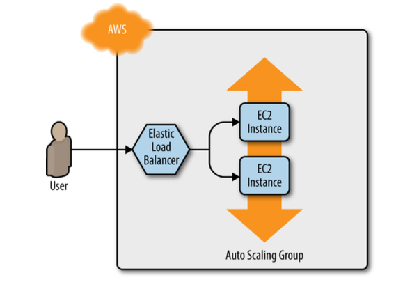

# Chapter 2

Don’t Repeat Yourself (DRY) principle  
every piece of knowledge must have a single, unambiguous, authoritative representation within a system

In the exercise created simple webserver with Auto Scaling group and listeners. Made one change in the code because the resource changed. 

This is what we build
  

This is the code from the book
```hcl
resource "aws_lb_listener_rule" "asg" { 
    listener_arn = aws_lb_listener.http.arn 
    priority = 100
    condition {
      field  = "path-pattern"
      values = ["*"]
    }
    
    action {
      type             = "forward"
      target_group_arn = aws_lb_target_group.asg.arn
    } 
}
```

This is the code that works
```hcl
resource "aws_lb_listener_rule" "asg" {
  listener_arn = aws_lb_listener.http.arn
  priority     = 100
  condition {
    path_pattern {
      values = ["*"]
    }
  }
```